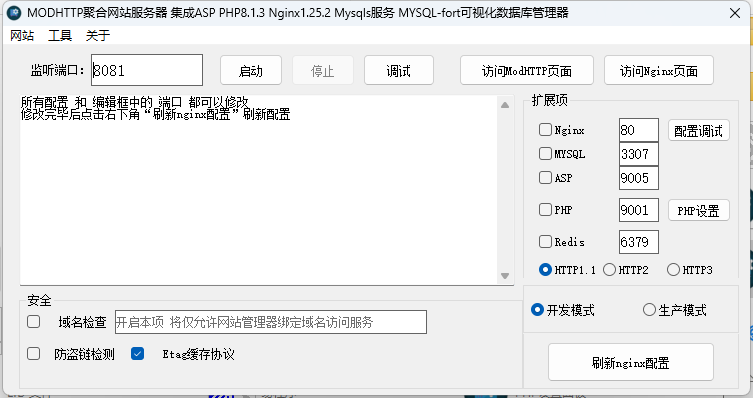
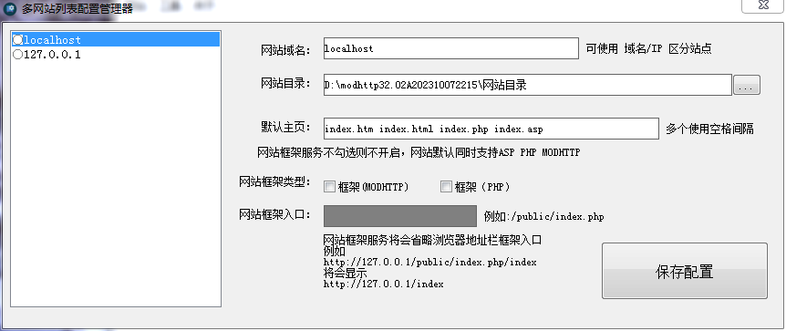
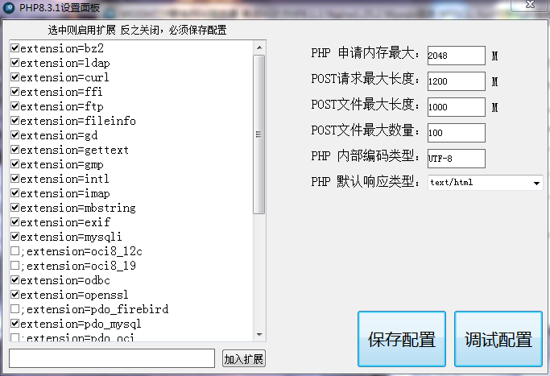
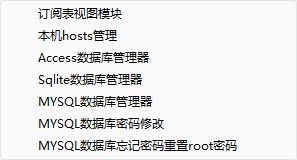

# MODHTTP SERVER


项目地址：https://gitee.com/wxgshuju/modhttp-server


开源中国：https://www.oschina.net/p/modhttp-server


#### 介绍
MODHTTP SERVER是采用国产化编程易语言开发的网站服务器软件。该程序集成Nginx+ASP+PHP+MySQL+Openssl+HOSTS+MYSQL-FORM+Sqlite数据库管理器+Access数据库管理器;支持HTTP1.1协议、HTTP2协议、HTTP3协议，该工具实现NGINX配置可视化编辑、PHP可视化配置可视化编辑，该程序不仅包括ASP、PHP、Modhttp调试环境，还包括了开发工具、开发手册等

#### 声明

本软件基于开源协议Apache发布，允许转发，允许第三方修改，本软件永久免费，终身免费

软件开发者：魔帝本尊

支持平台：Windows

优点：绿色服务解压即可安装，一键可视化配置即可使用

项目状态：持续更新维护中...

本软件已经开源，如需要程序源码请在OPEN-SOURCE中查看.

#### 软件架构

本软件需要安装以下运行库库
Microsoft Visual C++ 2015-2022 Redistributable 14.38.32919.0 (2023-08-09)

x64 [https://download.visualstudio.microsoft.com/download/pr/02a6d5c5-3e10-47de-8025-d97a1321d3e3/5F60592799FAE0C82578112D4B621438FFC976AB39D848D8F7623F5705A83E27/VC_redist.x64.exe](https://download.visualstudio.microsoft.com/download/pr/02a6d5c5-3e10-47de-8025-d97a1321d3e3/5F60592799FAE0C82578112D4B621438FFC976AB39D848D8F7623F5705A83E27/VC_redist.x64.exe)

x86 [https://download.visualstudio.microsoft.com/download/pr/02a6d5c5-3e10-47de-8025-d97a1321d3e3/AD573D3198853FC71137A88E51ABDE844B84F29B0CE6DD91BBEC661BC0143B36/VC_redist.x86.exe](https://download.visualstudio.microsoft.com/download/pr/02a6d5c5-3e10-47de-8025-d97a1321d3e3/AD573D3198853FC71137A88E51ABDE844B84F29B0CE6DD91BBEC661BC0143B36/VC_redist.x86.exe)

#### 下载路径

最新版本：32.02

Gitee（含源码）：[https://gitee.com/wxgshuju/modhttp-server/raw/master/MODHTTP_SERVER32.02.7z](https://gitee.com/wxgshuju/modhttp-server/raw/master/MODHTTP_SERVER32.02.7z)

代码库中所有文件经过病毒扫描查杀


.e文件    是易语言源代码

.api文件  是MODHTTP专属的易语言网页视图模块文件，作用等同PHP、ASP

内存加速1.7.ec  来源为汇编大神 白银大佬(2962946246) 无偿提供


e2ee.fne e2ee_staticlib e2ee_static.res 来源为 E2EE网站迅捷开发群(536544662) 

2.3.2免费版支持库

源码中用到了编码转换类，动态内存库类等...


本地调试器.exe   是MODHTTP专属视图模块的调试工具，可以清晰看到浏览器请求到MODHTTP 8081端口的各种信息

如果仅用PHP、ASP、MySQL等集成环境 不使用MODHTTP网页视图模块文件则无需打开本地调试器.exe


#### 安装教程

1.  解压后打开<<MODHTTP.exe>>

2.  解压路径中不允许有空格，建议解压到根目录，例如C:\ D：\等

#### 使用说明



1.  打开<<MODHTTP.exe>>



2.  首次使用打开后点击左上角菜单>网站管理;打开网站管理器增填、修改网站目录，修改完成后点击【保存配置】按钮，关闭此窗口

3.  点击启动,在首页右侧找到扩展项>Nginx>配置调试，点击【配置调试】按钮，页面显示以下内容则配置成功，可以启动服务。

```
nginx: the configuration 
conf/nginx.conf syntax is ok
nginx: configuration file D:\modhttp32.02A202310072215\modhttp-server\nginx/conf
/nginx.conf test is successful
```


4.按需要勾选组件，如Nginx，Mysql，ASP，PHP等，在选项前面打勾启动服务，如需关闭请再次点击取消√则停止服务



5.启动服务后点击右上角【访问nginx页面】按钮，开始尽情的写BUG吧




#### 帮助

鼠标光标移动到功能，文字标题会显示帮助提示和信息
