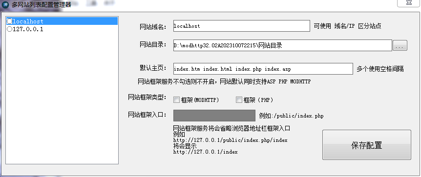
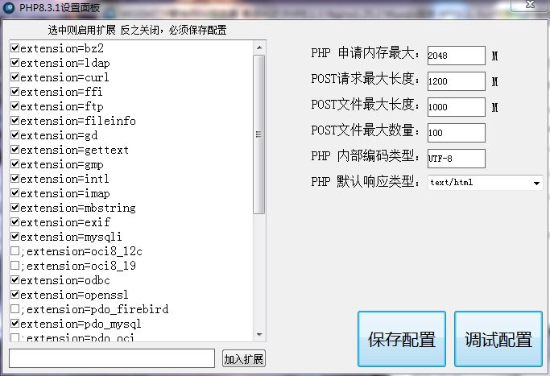

# MODHTTP SERVER
#### 代码开源
	开发者：@魔帝本尊
本软件基于开源Apache协议公开发布，允许转发，允许第三方修改，本软件永久免费，终身免费，持续更新维护中...
本软件以开源，如需要程序源码在OPEN-SOURCE中查看.

#### 介绍
MODHTTP SERVER是采用国产化编程易语言开发的服务器软件。支持所有Windows系统版本，该程序集成最新的Nginx+ASP+PHP+MySQL+Openssl+HOSTS+MYSQL-FORM+Sqlite数据库管理器+Access数据库管理器;支持HTTP1.1/HTTP2/HTTP3,绿色服务一次性安装，实现NGINX配置可视化管理、PHP可视化配置，一键启动即可使用非常方便快捷、是一个好用的网站搭建调试环境。

#### 声明
开发者：@魔帝本尊
本软件基于开源Apache协议公开发布，允许转发，允许第三方修改，本软件永久免费，终身免费，持续更新维护中...
本软件以开源，如需要程序源码在OPEN-SOURCE中查看.
#### 软件架构
本软件需要安装以下运行库库
Microsoft Visual C++ 2015-2022 Redistributable 14.38.32919.0 (2023-08-09)

x64 [https://download.visualstudio.microsoft.com/download/pr/02a6d5c5-3e10-47de-8025-d97a1321d3e3/5F60592799FAE0C82578112D4B621438FFC976AB39D848D8F7623F5705A83E27/VC_redist.x64.exe](https://download.visualstudio.microsoft.com/download/pr/02a6d5c5-3e10-47de-8025-d97a1321d3e3/5F60592799FAE0C82578112D4B621438FFC976AB39D848D8F7623F5705A83E27/VC_redist.x64.exe)

x86 [https://download.visualstudio.microsoft.com/download/pr/02a6d5c5-3e10-47de-8025-d97a1321d3e3/AD573D3198853FC71137A88E51ABDE844B84F29B0CE6DD91BBEC661BC0143B36/VC_redist.x86.exe](https://download.visualstudio.microsoft.com/download/pr/02a6d5c5-3e10-47de-8025-d97a1321d3e3/AD573D3198853FC71137A88E51ABDE844B84F29B0CE6DD91BBEC661BC0143B36/VC_redist.x86.exe)

#### 源码下载途径
最新版本:32.02A202310072215
历史版本源码下载地址

百度云下载下载[链接：https://pan.baidu.com/s/1SZzsI0wtXpAUBjy4AfCqUg?pwd=yoiu 
提取码：yoiu](https://pan.baidu.com/s/1SZzsI0wtXpAUBjy4AfCqUg?pwd=yoiu )

#### 安装教程

1.  解压后打开<<MODHTTP.exe>>

2.  解压路径中不允许有空格，建议解压到根目录，例如C:\ D：\等

#### 使用说明


1.  打开<<MODHTTP.exe>>



2.  首次使用打开后点击左上角菜单>网站管理;打开网站管理器增填、修改网站目录，修改完成后点击【保存配置】按钮，关闭此窗口

3.  点击启动,在首页右侧找到扩展项>Nginx>配置调试，点击【配置调试】按钮，页面显示以下内容则配置成功，可以启动服务。

```
nginx: the configuration 
conf/nginx.conf syntax is ok
nginx: configuration file D:\modhttp32.02A202310072215\modhttp-server\nginx/conf
/nginx.conf test is successful
```


4.按需要勾选组件，如Nginx，Mysql，ASP，PHP等，在选项前面打勾启动服务，如需关闭请再次点击取消√则停止服务



5.启动服务后点击右上角【访问nginx页面】按钮，开始尽情的写BUG吧


#### 帮助

鼠标光标移动到功能，文字标题会显示帮助提示和信息
